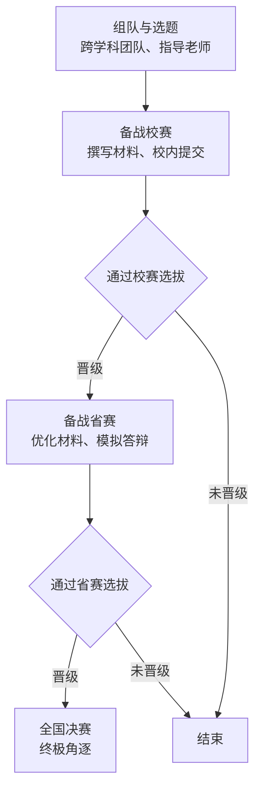

# 挑战杯项目方向参考表

| 项目方向 | 核心思路 | 技术专长应用 | 参考案例（获奖情况） |
|---------|----------|-------------|---------------------|
| 智能医学影像 | 将AI算法（生成式模型、深度学习）应用于医学影像处理，辅助诊断 | 图像处理算法、模型优化与部署 | 智辅微创：生成式AI赋能的三维光声显微成像系统（国家级三等奖） 光声多模态淋巴结智能定位系统（全国特等奖） |
| 疾病风险预测与评估 | 基于多模态数据（医学影像、生理信号）构建AI模型，预测疾病风险 | 数据建模、信号处理、机器学习 | "脑"有慧算：基于个体化建模与深度学习的颅内动脉瘤破裂风险智能评估模型（专项赛推荐项目） |
| 便携/可穿戴医疗设备 | 研发用于慢病管理、康复监测或特定场景的智能硬件设备 | 嵌入式开发、传感器技术、电路设计 | "心"欣向荣：心肌梗死后居家康复监测设备（校赛获奖） "一卒即发"：便携式可穿戴脑栓塞预警设备（校赛获奖） |
| 智能手术导航与机器人 | 开发用于血管介入、骨科等手术的导航平台或手术机器人系统 | 硬件系统集成、算法开发 | 得心应手：泛血管智能导航诊疗技术平台（全国一等奖） 基于数字孪生技术的穿刺机器人系统（校赛获奖项目） |
| 中医药现代化 | 将电子信息工程技术应用于中医药诊疗的量化与标准化 | 信号检测、数据分析、设备开发 | "穴"探未来：智能穴位温度检测仪（专项赛推荐项目） AI与针灸推拿交叉融合研究 |

| 项目方向 | 核心思路 | 技术专长应用 | 潜在成果 |
|---------|----------|-------------|----------|
| 智慧医院系统优化 | 针对现有医院信息系统（HIS/PACS等）的痛点进行智能化升级 | 软件开发、系统架构、数据处理 | 智能分诊系统、医疗数据管理平台、智慧病房解决方案 |
| 远程医疗与智能监护 | 基于5G/物联网技术的远程诊疗和实时健康监测系统 | 通信技术、嵌入式系统、App开发 | 远程会诊平台、智能居家监护系统、急诊急救协同系统 |
| 医学大数据平台 | 构建专病数据库并开发数据分析工具 | 数据库管理、数据挖掘、云计算 | 专科疾病数据库、临床科研数据分析平台、基因组数据分析工具 |

# “挑战杯”参赛全流程指南

### 1. 明确赛事类型

“挑战杯”系列竞赛主要分为两类：

| 赛事名称 | 俗称 | 侧重方向 | 作品形式举例 |
|----------|-----------|-----------|---------|
| “挑战杯”大学生课外学术科技作品竞赛 | “大挑” | 侧重学术研究、科技创新和实物发明 | 学术论文、科技发明制作、社会调查报告 |
| “挑战杯”大学生创业计划竞赛 | “小挑” | 侧重项目的商业价值与创业可行性 | 商业计划书、项目路演PPT、模拟运营 |

### 2. 参赛核心步骤

一个完整的“挑战杯”参赛周期通常包括以下环节：

#### 参赛具体步骤

###### 第一步：组建团队<--
  + 人员构成：寻找在技术、市场、财务、演讲等各方面能力互补的队友。
  + 跨学科优势：鼓励跨专业、跨学院组队。
  + 指导老师：邀请1-3位在相关领域有深入研究或资源的老师进行指导。
###### 第二步：确定项目与赛道
  + 项目选题：结合您的专业背景，选择有创新性和社会价值的题目。
  + 选择赛道：
    1. “大挑” 常见赛道：自然科学类学术论文、哲学社会科学类社会调查报告、科技发明制作A/B类。
    2. “小挑” 常见赛道：科技创新和未来产业、乡村振兴和农业农村现代化、城市治理和社会服务等。
  + 专项赛：同时关注 “人工智能+”、“揭榜挂帅” 等专项赛道，它们目标明确，竞争维度不同。
###### 第三步：准备与提交参赛材料
  + “大挑”核心材料：
    · 项目申报书
    · 完整的学术论文 / 调查报告 / 科技发明说明书
    · 专利、论文发表、应用证明等佐证材料
  + “小挑”核心材料：
    · 项目申报表
    · 详细的商业计划书
    · 项目介绍PPT（用于路演答辩）
    · 专利、原型、试用证明等支撑材料
###### 第四步：逐级参赛
  + 校赛：由各高校自行组织选拔，通常在每年上半年或前一年年底进行。这是晋级的基础。
  + 省赛：由各省（市、区）组织，各校优胜作品参赛，通常在春季或夏季。
  + 全国赛：各省推荐优秀作品参加，通常在下半年（如10月、11月）举行。

#### 3. 关键时间节点与信息来源

| 阶段 | 关键行动 | 信息来源 |
|-----------|----------|-----------|
| 备赛期 | 组队、选题、研发、撰写材料 | 团队内部讨论、指导老师指导 |
| 校赛 | 提交材料、参加校内答辩 | 本校团委官网/公众号、学院通知 |
|省赛 | 根据反馈优化项目、提交省赛材料 | 省赛组委会通知、学校团委转发 |
|国赛 | 终极打磨、参加全国决赛 | 全国赛组委会通知、学校统一组织 |

重要提示：请务必密切关注您所在学校团委发布的通知，这是获取最准确、最及时赛事信息的唯一官方渠道。

#### 4. 提升项目竞争力的小贴士

+ 创新性：找到项目的核心创新点，可以是技术、模式或应用场景的创新。
+ 可行性：特别是科技发明类，要有可实现的原型或扎实的数据支撑。
+ 社会价值：项目应致力于解决某个实际社会问题，体现家国情怀与社会担当。
+ 现场表现：路演答辩环节至关重要，需要反复演练，做到逻辑清晰、重点突出、应答如流。
